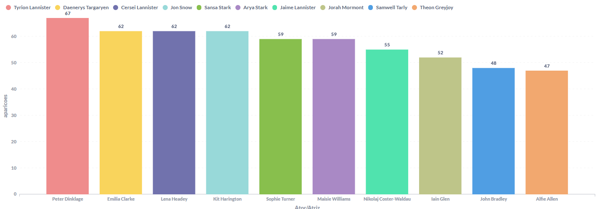

<h1 align="center">⚔ GoT Analytics 📊</h1>

## Propósito do projeto:

<h3><b>Análisar banco de dados cedido a partir tema escolhido (Game of Thrones) e a após a análise: criar gráficos que facilitem a visualização de questões criadas e pensadas pelo time, lembrando que esse processo foi concluído exclusivamente de acordo com os dados.<b></h3><br><br>

<h3>Exemplo:</h3>
  

  
Query:
```
  SELECT ator_atriz, nome, aparicoes FROM personagens ORDER BY aparicoes DESC LIMIT 10;
```
<p><b><i>A partir dos dados, usando Querys do MySQL conseguimos concluir que os atores/atrizes que mais participaram da série Game of Thrones foram esses citados, além disso, através  da ferramenta Metabase, criamos um gráfico para facilitar a visualização da seleção dos dados que fizemos pelo MySQL.</i><b><p>
  
---

## Ferramentas utilizadas:

> [Acesse aqui o MySQL](https://www.mysql.com/)
> 
> [Acesse aqui o Metabase](https://www.metabase.com/)
> 
> 
> 
> 
> 
> 

---

### 📝Instruções para utilizar o projeto:

1. Instalar o programa MySQL no seu servidor

2. Utilizar o schema na pasta ./database/got_database.sql

3. Executar as queries na pasta ./queries

4. A função das queries estão em comentários em cada arquivo

---

## 💻 Equipe de Desenvolvedores

| [<br><sub>Caio Cavalcanti</sub>](https://www.linkedin.com/in/caio-cavalcanti-17b50b13a/) |  [<br><sub>Helio Franco</sub>](https://www.linkedin.com/in/dev-heliofranco/) |  [<br><sub>Israel Marques</sub>](https://www.linkedin.com/in/israel-marques-375017158/) | [<br><sub>Matheus Germano</sub>](https://www.linkedin.com/in/matheusgermanodesouza/) |
| :---: | :---: | :---: | :---: | 
