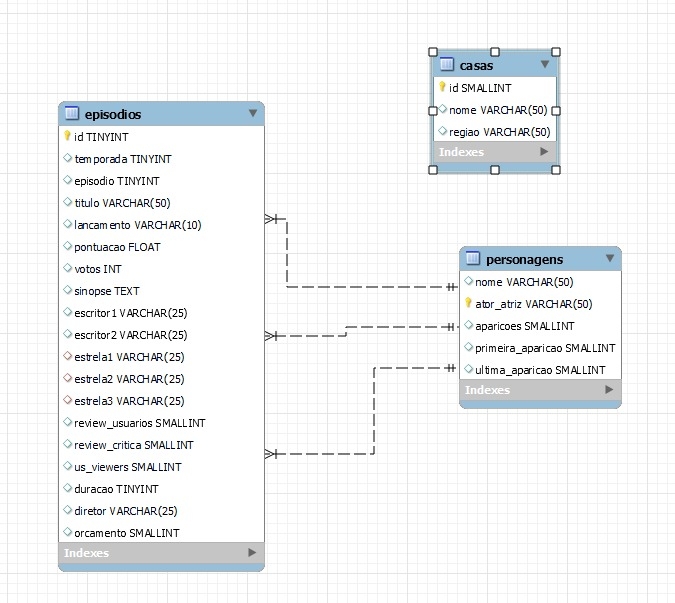

# ⚔ GoT Analytics 📊

---


 
 [](http://makeapullrequest.com)


 
 [](https://github.com/matgermano/GoT_Analytics/network/)
 
 [](https://github.com/matgermano/GoT_Analytics)
 
 ---
 
## Propósito do projeto:

### <b>Análisar banco de dados cedido a partir tema escolhido (Game of Thrones) e a após a análise: criar gráficos que facilitem a visualização de questões criadas e pensadas pelo time, lembrando que esse processo foi concluído exclusivamente de acordo com os dados.<b></h3><br><br>

### Relação dos dados:
 > 

### Exemplo:
  
> <div align="center"> 
 </div>
  
Query:
```
  SELECT ator_atriz, nome, aparicoes FROM personagens ORDER BY aparicoes DESC LIMIT 10;
```
<p><b><i>A partir dos dados, usando Querys do MySQL conseguimos concluir que os atores/atrizes que mais participaram da série Game of Thrones foram esses citados, além disso, através  da ferramenta Metabase, criamos um gráfico para facilitar a visualização da seleção dos dados que fizemos pelo MySQL.</i><b><p>
  
---

## Ferramentas utilizadas:

> [Acesse aqui o MySQL](https://www.mysql.com/)
> 
> [Acesse aqui o Metabase](https://www.metabase.com/)
> 
> 
> 
> 
> 
> 

---

### 📝Instruções para utilizar o projeto:

1.Acesse o <a href='https://drive.google.com/drive/folders/1vWOXld-1rxQsFj0_QhtEpaAvD0Fbwefx'> Banco de Dados </a> utilize os arquivos SQL para estruturar e as chaves para relacionar as tabelas (tratar os dados).
 
2. Instalar o programa MySQL no seu servidor

3. Utilizar o schema na pasta ./database/got_database.sql

4. Executar as queries na pasta ./queries

5. A função das queries estão em comentários em cada arquivo

---

## 💻 Equipe de Desenvolvedores

| [<br><sub>Caio Cavalcanti</sub>](https://www.linkedin.com/in/caio-cavalcanti-17b50b13a/) |  [<br><sub>Helio Franco</sub>](https://www.linkedin.com/in/dev-heliofranco/) |  [<br><sub>Israel Marques</sub>](https://www.linkedin.com/in/israel-marques-375017158/) | [<br><sub>Matheus Germano</sub>](https://www.linkedin.com/in/matheusgermanodesouza/) |
| :---: | :---: | :---: | :---: | 
